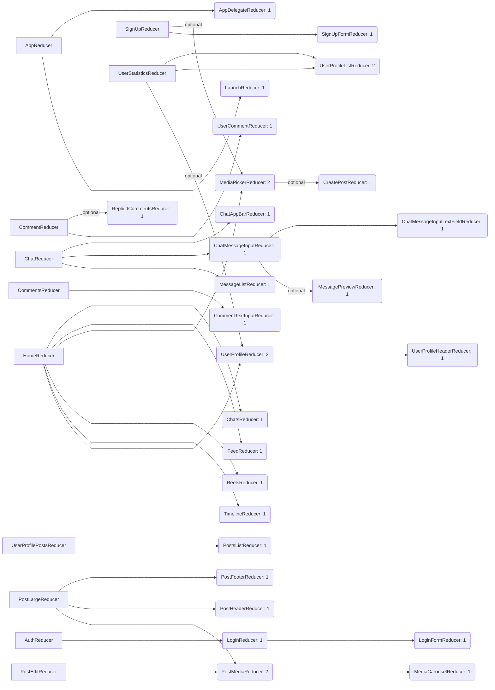

## Build based upon [PowerSync](https://github.com/powersync-ja/powersync-swift.git) and [Supabase](https://github.com/supabase/supabase-swift.git)

| Login | Home | Comments | Reels | UserProfile | PhotoPicker | Chat |
|-|-|-|-|-|-|-|
|  |  |  |  |  |  | 

## Code structure

  
